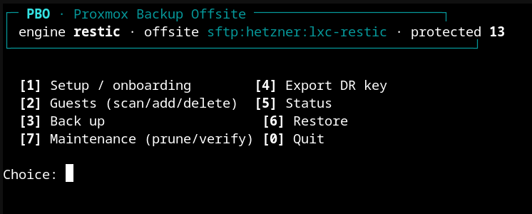
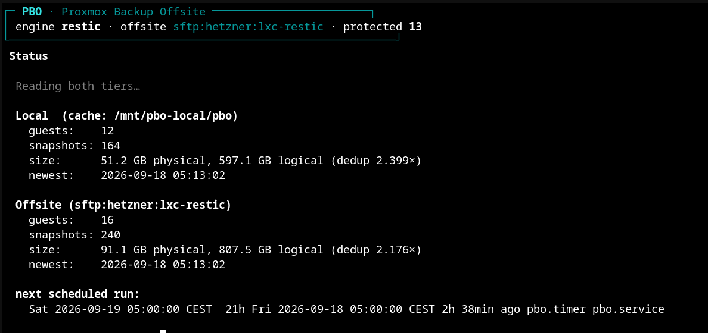

# pbo

This backs up Proxmox guests (LXC and QEMU) to an SFTP server using
[restic](https://restic.net/). That's it. It is not trying to be Proxmox Backup
Server, and if PBS works for you, go use PBS.

It exists because I wanted an encrypted offsite copy without running yet another
server for it. restic already does dedup, encryption and incremental backups over
plain SFTP, so pbo is mostly glue: it runs `vzdump`, throws the archive into a restic
repo, and pushes it offsite. Restore does the reverse and feeds the archive to
`pct restore` or `qmrestore`, always into a new VMID. No daemon, no web service. You
run `pbo menu`, or the individual commands if you'd rather type.

> This is beta. It backs up and restores real machines and there's a test suite, but I
> still change things. If you put the only copy of something important in here and it
> eats it, that's on you.

## Screenshots

It's a text menu, so here's the menu and the status screen. Now you know what you're
getting before you clone it.





## Why restic, and not something clever

Because restic already solved the hard parts and I'm not going to reinvent them badly.
It speaks SFTP itself, so there's no FUSE mount and no rclone in the middle.
Everything goes into one repo no matter how many guests or nodes you have. The repo
password is both the encryption key and the recovery key. Lose it and the data is gone
for good, and no, I can't get it back for you. Back it up.

## Requirements

Nothing exotic:

- A Proxmox host, obviously (`pct`, `qm`, `vzdump`).
- `restic`, `jq`, `zstd`, `flock`, `curl`. `install.sh` installs whatever you're missing.
- An SFTP target you can log into with a key. Storage Box paths are relative because the
  account is chrooted. That's not a bug.

## Install

```bash
git clone https://github.com/TubalQ/PBO
cd PBO
sudo ./install.sh
```

Goes into `/usr/local`. It offers to run setup. It does not enable the timer, because
turning on background jobs behind your back is rude.

## Quick start

```bash
pbo setup     # engine, cache, sftp, password, mode
pbo menu      # guests, backup, restore, status
```

`setup` writes `/etc/pbo/config` and creates the repo. Then pick your guests, run a
backup, and export the DR key somewhere safe. I mean it about that last one.

Nightly:

```bash
systemctl enable --now pbo.timer     # 05:00
```

## Clusters

There is no cluster magic. You install it on every node and each node backs up its own
guests into the same repo. That is exactly how Proxmox's own backup jobs work, and it's
fine. No coordinator, no node SSHing into another node, none of that.

```bash
sudo ./install.sh
pbo setup                            # same repo, same password
systemctl enable --now pbo.timer
```

With `BACKUP_ORDER=auto` each node works out its own guests. Move a guest to another
node and that node backs it up on the next run; restic tags snapshots by vmid, so the
history isn't lost.

Three things, and if you get them wrong it's your own fault:

- Same repo password on every node, in `/etc/pbo/restic-pass`. Do NOT put it in
  `/etc/pve`. pmxcfs replicates that directory in cleartext, which defeats the whole
  point.
- If you hate editing the config N times, put the non-secret parts in
  `/etc/pve/pbo/config` and let pmxcfs sync it. The local file still holds the password
  and wins on conflicts.
- Prune from one node only. It takes an exclusive lock. Set `PRUNE_OWNER` if you can't
  keep track.

## Commands

```
pbo [global flags] <command> [arguments]

Global flags:
  --json              machine-readable output
  --dry-run           show what would happen, do nothing

Commands:
  setup                       setup wizard
  menu                        interactive prompt
  init                        create or verify the repo
  backup <vmid>               back up one guest
  run-schedule [--stream|--batch]   back up this node's guests
  status                      running jobs and lock holder
  list [vmid]                 offsite archives
  restore <vmid> <ts> --to N  restore to a new vmid
  verify                      restic integrity check
  prune                       apply retention
  test-restore <vmid>         restore to a throwaway vmid, boot, destroy
```

## Modes

| Setting | Effect |
|---|---|
| `LOCAL_REPO=true`  | Keep a local repo, copy each snapshot offsite. Fast local restores. |
| `LOCAL_REPO=false` | Straight to SFTP. Barely touches local disk. |
| `BACKUP_MODE=stream` | One guest at a time (default). Low disk. |
| `BACKUP_MODE=batch`  | Dump everything to cache first, then upload, if it fits. |

## Disaster recovery

The point of a backup is the restore, so: the host is dead, you have a clean machine.
Install pbo, give it the same repo password (the DR key), restore. It always restores to
a new VMID and refuses to overwrite a running guest, on purpose. If you don't trust that
it works, and you shouldn't trust a backup you've never tested, run `test-restore`. It
restores a throwaway copy, boots it, and throws it away.

## Configuration

Everything is documented in `etc/config.example`. The only secret is the repo password
(`RESTIC_PASSWORD_FILE`, 0600). The config file itself has nothing sensitive in it, so
stop worrying about it.

## Contributing

Patches welcome. It's plain bash with tests in `tests/`. If you change behaviour and
don't add a test, I'm going to ask you to add a test.

## License

AGPL-3.0-or-later. See `LICENSE`.
